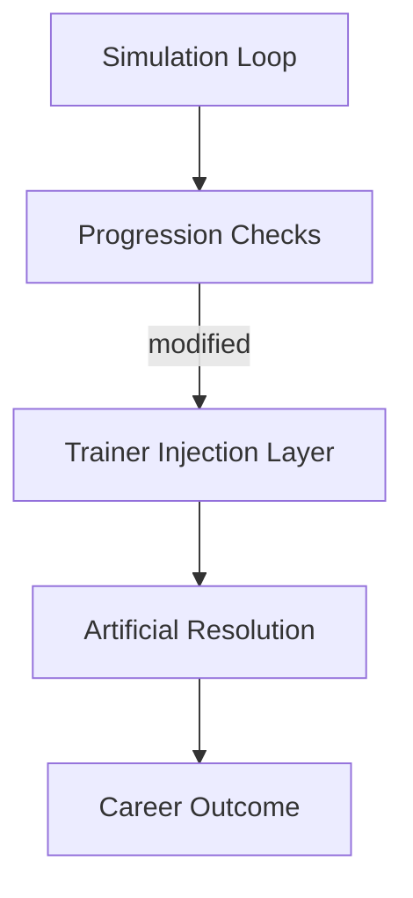

## Overview

Built around creator-simulation logic, **Youtubers Life 3 Trainer** interfaces with the running management loop of Youtubers Life 3 to manipulate how progression systems resolve in real time. Instead of editing saves or presets, the trainer intervenes at evaluation points such as skill growth, content output, social metrics, and time consumption. The result is temporary control over creator behavior, channel development, and daily flow while the simulation remains active.

---

## Creator Attribute Regulation

* Skill level adjustment across content categories
* Energy, stress, and motivation control
* Growth rate scaling

**Simulation effect:**
Overrides how creator attributes evolve over time without changing long-term profile data.

---

## Content Production Manipulation

* Instant video creation
* Quality score forcing
* Upload cooldown bypass

**System behavior:**
Resolves content generation steps immediately, skipping production-time constraints while preserving format logic.

---

## Audience and Metric State Control

* Subscriber count injection or freeze
* View and engagement multiplier tuning
* Trend influence override

**Simulation effect:**
Manipulates metric calculations used to evaluate channel performance and popularity.

---

## Schedule and Time Consumption Overrides

* Activity duration reduction
* Day and hour skip controls
* Fatigue accumulation suppression

**System behavior:**
Collapses time-based costs tied to recording, editing, and social actions.

---

## Income and Economy Adjustment

* Revenue value setting
* Sponsorship payout control
* Expense validation bypass

**Simulation effect:**
Alters economic resolution rules without modifying contract structures or shop inventories.

---

## Social Interaction and Relationship Logic

* Relationship level editing
* Event success forcing
* Reputation penalty removal

**System behavior:**
Overrides social outcome checks that normally depend on timing, mood, or preparation.

---

## Career and Unlock Gate Forcing

* Career milestone unlock
* Feature and location access
* Progression flag inspection

**Simulation effect:**
Treats progression gates as permission flags rather than earned milestones.

---

## Trainer Control Interface

* Category-based toggle layout
* Hotkey-bound activation
* Full state restore on unload

**System behavior:**
Ensures all injected states can be reverted cleanly, restoring default simulation rules.

---

---

## FAQ

**Does the trainer modify save files?**
No, all changes apply only during the active simulation session.

**Can metrics be frozen without increasing them?**
Yes, values can be locked at their current state.

**Are career unlocks permanent?**
Unlocked states revert unless reapplied in a new session.

**Does time skipping break daily events?**
Event logic is preserved while time costs are suppressed.

**Can social penalties be restored?**
Relationship and reputation logic resumes once overrides are disabled.

**Is there a global reset option?**
All systems support full restoration before unloading.

---

## Feature Summary

* Creator skill and attribute regulation
* Content production time and quality control
* Subscriber and engagement metric manipulation
* Schedule and fatigue cost suppression
* Income and sponsorship value overrides
* Social relationship outcome control
* Career progression gate forcing
* Session-scoped trainer with safe rollback

---
